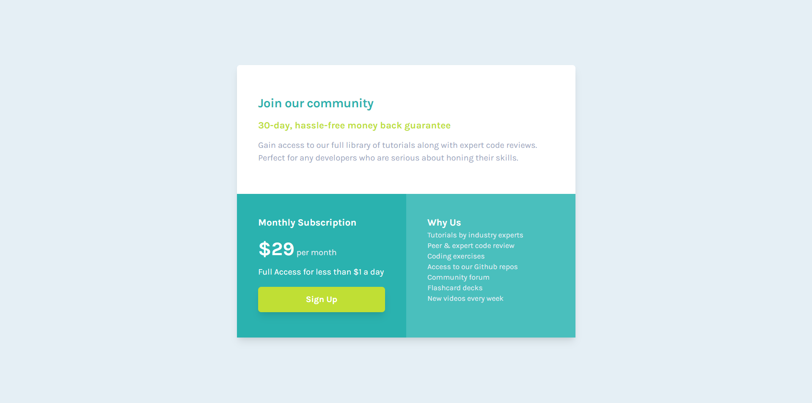

# Frontend Mentor - Single price grid component solution

This is a solution to the [Single price grid component challenge on Frontend Mentor](https://www.frontendmentor.io/challenges/single-price-grid-component-5ce41129d0ff452fec5abbbc). Frontend Mentor challenges help you improve your coding skills by building realistic projects. 

## Table of contents

- [Frontend Mentor - Single price grid component solution](#frontend-mentor---single-price-grid-component-solution)
  - [Table of contents](#table-of-contents)
  - [Overview](#overview)
    - [The challenge](#the-challenge)
    - [Screenshot](#screenshot)
    - [Links](#links)
  - [My process](#my-process)
    - [Built with](#built-with)
    - [What I learned](#what-i-learned)
    - [Continued development](#continued-development)
  - [Author](#author)

**Note: Delete this note and update the table of contents based on what sections you keep.**

## Overview

### The challenge

Users should be able to:

- View the optimal layout for the component depending on their device's screen size
- See a hover state on desktop for the Sign Up call-to-action

### Screenshot

### Links

- Solution URL: [Add solution URL here](https://www.frontendmentor.io/solutions/single-price-grid-tailwind-html-vite-78Qvmp-Ps)
- Live Site URL: [Add live site URL here](https://donmatano.github.io/single-price-grid/)

## My process

### Built with

- HTML
- Tailwind
- Vite

### What I learned

- How to use Vite to set up my vanilla project.
- Hot to use Grid system in Tailwind.

### Continued development

Continue to use Tailwind as my Css Utility framework.

## Author
- Frontend Mentor - [@DonMatano](https://www.frontendmentor.io/profile/DonMatano)
- Twitter - [@MMatano5](https://www.twitter.com/MMatano5)
